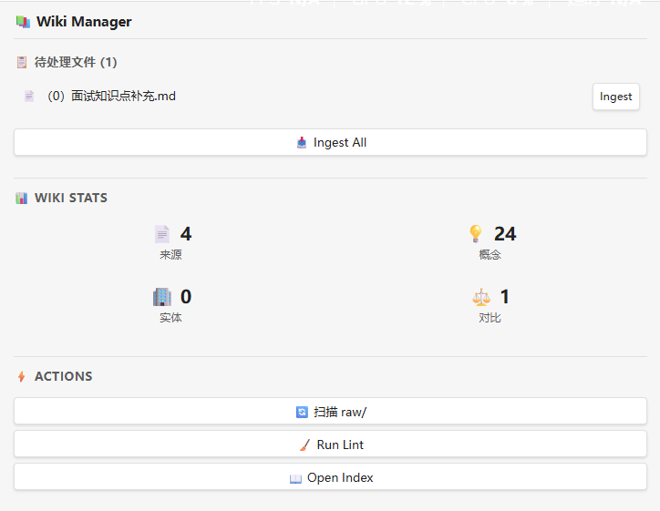

# Wiki Manager

Obsidian plugin for managing a Wiki knowledge base. Scan `raw/` for unprocessed files, trigger AI-powered ingest, run lint checks — all from a sidebar panel.

## Background

This plugin implements the **LLM Wiki** pattern described by [Andrej Karpathy](https://karpathy.ai). Read the full methodology: [[docs/karpathy-wiki-methodology.md](docs/karpathy-wiki-methodology.md) (English)] [[docs/karpathy-wiki-methodology.zh.md](docs/karpathy-wiki-methodology.zh.md) (中文)]

> Instead of using LLMs for one-off RAG queries, incrementally build and maintain a **persistent, structured wiki** — a collection of interlinked Markdown files sitting between you and your raw source materials.

**The core insight**: RAG makes the LLM re-discover knowledge from scratch every query. Nothing accumulates. A wiki is different — it's a **living, compounding artifact**. Cross-references are already in place. Contradictions are flagged. Syntheses already reflect everything you've read. Each new document and each question makes the wiki richer.

### Three-layer architecture

| Layer | Contents | Managed by |
|-------|----------|------------|
| **Raw** (`raw/`) | Source documents — articles, papers, interview Q&As | You (read-only for AI) |
| **Wiki** (`wiki/`) | Structured Markdown — summaries, concepts, entities, comparisons | AI (read-only for you) |
| **Schema** (`CLAUDE.md`) | Rules for structure, conventions, and workflows | Both, evolving together |

### Workflow

1. **You** drop a new file into `raw/`
2. **Wiki Manager** detects the unprocessed file and offers one-click ingest
3. **AI** reads the file, extracts key info, creates/updates wiki pages, cross-references with existing knowledge, and logs everything
4. **You** browse the updated wiki in Obsidian — follow links, view the graph, read updated pages

Obsidian is the IDE. The AI is the programmer. The wiki is the codebase.

## Features

- **Scan raw/** — Detects files in `raw/` that haven't been referenced by any source page in `wiki/来源/`
- **One-click Ingest** — Sends an ingest request directly to the [Claudian](https://github.com/YishenTu/claudian) AI assistant
- **Wiki Stats** — Shows counts of source, concept, entity, and comparison pages
- **Lint Check** — Displays health check checklist, can notify Claudian to execute
- **Open Index** — Quick open `wiki/index.md`



## How It Works

Wiki Manager integrates with [Claudian](https://github.com/YishenTu/claudian) — an Obsidian plugin that embeds Claude Code as an AI collaborator. When you click "Ingest", the plugin calls Claudian's internal API to send a message directly into the conversation, triggering the AI to process the raw file according to your knowledge base workflow.

**Fallback**: If Claudian is not detected, the plugin writes tasks to `.claude/pending-ingest.json` for batch processing on next session start.

### Vault Structure

The plugin expects a vault organized like this:

```
vault/
├── raw/                     # Raw materials (user-managed)
├── wiki/                    # Knowledge base (AI-maintained)
│   ├── index.md
│   ├── log.md
│   ├── 来源/                # Source summaries
│   ├── 概念/                # Concept pages
│   ├── 实体/                # Entity pages
│   └── 对比/                # Comparison pages
└── CLAUDE.md                # Workflow schema
```

The detection logic checks source pages in `wiki/来源/` for `[[raw/...]]` wikilinks or `source:` frontmatter references to determine which raw files have been processed.

## Installation

### From Source

1. Copy `main.js`, `manifest.json`, and `styles.css` to `.obsidian/plugins/wiki-manager/` in your vault
2. Enable the plugin in Settings → Community plugins → Wiki Manager

### Via BRAT (Beta Reviewers Auto-update Tester)

Add this repository URL in BRAT settings.

## Requirements

- Obsidian ≥ 1.4.0
- [Claudian](https://github.com/YishenTu/claudian) plugin (for real-time ingest)

## License

MIT

## Author

oll
